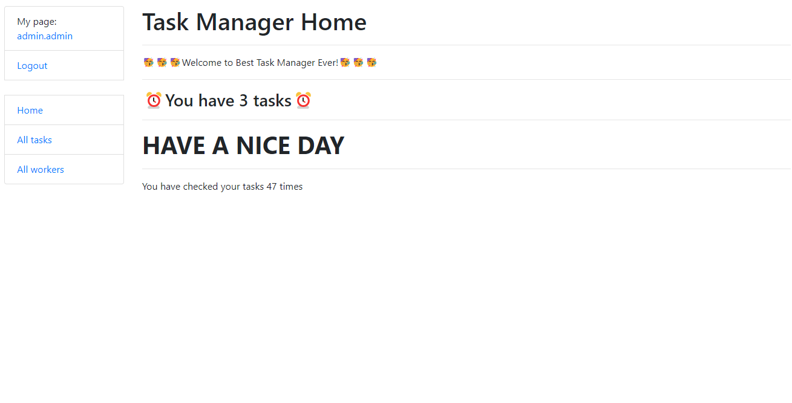
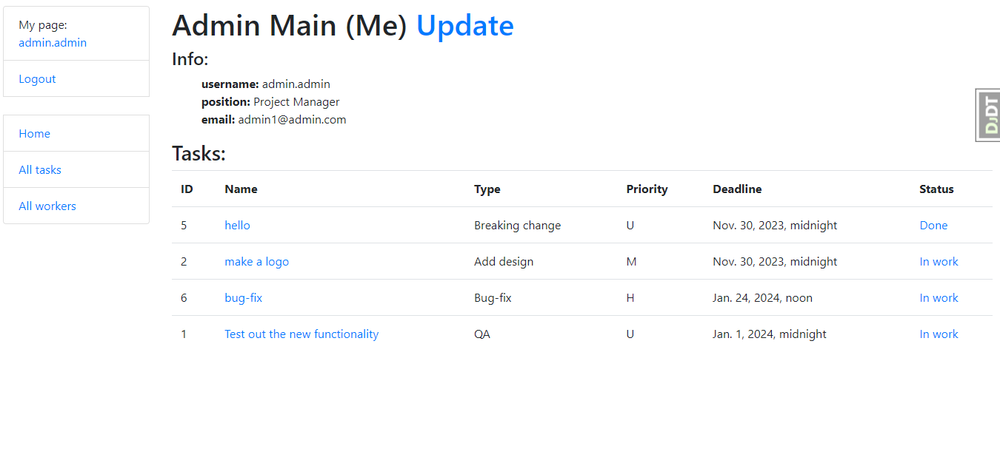

# IT Task Manager 
> Additional information

Project for bringing all your tasks, teammates, and tools together

[db_diagram](https://dbdiagram.io/d/655dfee53be149578783b389)

## Installing

A quick introduction of the minimal setup you need to get a task manager up &
running.

* Clone it
```shell
    git clone https://github.com/SevKrok/it-task-manager.git
```

* Make venv 
```shell
python -m venv venv
```

* Activation for Windows
```shell
.\venv\Scripts\activate
```

* Activation for macOS or Linux
```shell
source venv/bin/activate
```

* Install all libraries and frameworks, which you need for this project
```shell
pip install -r requirements.txt
```

* Make database and load fixture
```shell
python manage.py makemigrations
python manage.py migrate
python manage.py loaddata db.json
```

* Create admin for login
```shell
python manage.py createsuperuser
```


## Features
* Authentication functionality for Worker/User
* Managing tasks and workers directly from website interface
* Admin panel for advanced managing
* Worker can see his tasks on his account page
* And can see how many tasks he has on home page

## Check it out
[IT Task Manager](https://it-task-manager-8lid.onrender.com/)

## Demo



